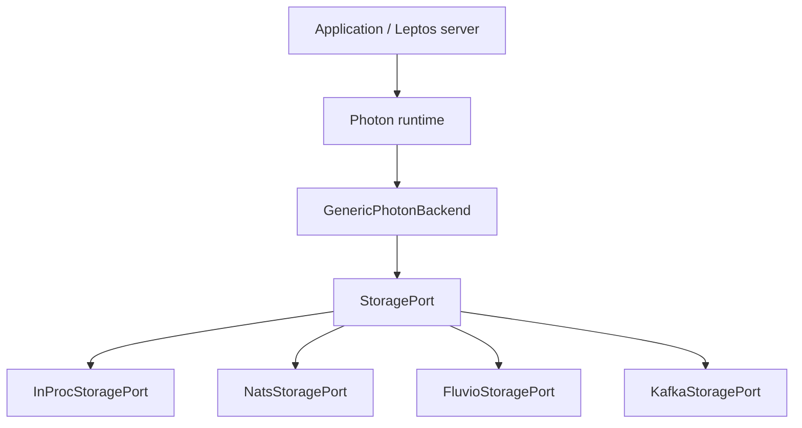

# Photon Pub/Sub Performance Across Storage Adapters and Deployment Topologies

Pre-registered workloads and runner commands: [`EXPERIMENTS.md`](EXPERIMENTS.md). Adapter contract: [docs.rs `photon` architecture](https://docs.rs/uf-photon/latest/photon/#architecture).

---

## Executive summary

Photon is a **typed pub/sub runtime** embedded in Rust services. Applications call `.publish()` / `#[subscribe]`; pluggable **storage adapters** (`mem`, `sqlite`, `nats`, `fluvio`, `kafka`) handle persistence and delivery. Payloads are encrypted in-process before append.

**Measured scope (primary row: `stream_seq` / `sync_ack=1` / 256 pubs / 100k target)**

| Surface | Status | Key number |
|---------|--------|------------|
| **NATS publish ingress** (BM-PFH) | **Measured** on `aws-c6i-large` in-VPC | **~94k ops/s** per embed; **~218k ops/s** aggregate with 4 embeds on 4-broker / 4-shard cluster |
| **Fluvio publish ingress** (BM-PFH) | **Measured** on `aws-c6i-large` in-VPC | **~93k ops/s** per embed; **~400k ops/s** aggregate with 4 embeds on 4-SPU / 4-shard cluster |
| **Kafka publish ingress** (BM-PFH) | **Measured** on `aws-c6i-large` in-VPC (campaign paused) | Primary row **~1.1k** (N=1) → **~2.7k** (sharded N=4); multibench bc=2 **~5k ops/s** |
| **NATS fleet smoke** (BM-PF0–PF4, BM-PB5, …) | **PASS** (delivery / error gates) | Functional cross-node delivery — **NATS-only** |
| **NATS scaling sweep** (BM-PB4) | **Informational** | n1/n3 ratio not gating; PFH + PF2/PF4 are ingress anchors |
| **`mem` CI / dev latency** (BM-P0, BM-PL*) | **PASS** on `aws-t3.medium` | Publish p50 **~0.008 ms**; sustained **~10k ops/s** (PL2) |

**Sizing rule of thumb**

- **NATS:** one embed host sustains **~90k publishes/s** on a 4-shard cluster; **4 embeds → ~218k ops/s**.
- **Fluvio:** similar per-embed (~93k) but near-linear multi-embed (**4 embeds → ~400k**, ~1.8× NATS).
- **Kafka (Photon + rskafka):** low thousands ops/s on this path — not for high ingress today.
- Size embed hosts before adding brokers once per-embed peak is saturated.

**Not measured in this study**

- Subscriber fanout or handler executor at PFH-scale publish rates.
- Kafka multibench bc=4 (campaign paused); Fluvio N=2/N=4 baseline+sharded ladders (not required for multibench comparison).
- Delivery / fanout gates (BM-PF*, BM-P6, …) on Kafka or Fluvio.

### Cross-broker PFH summary (2026-07-07, primary row)

| Broker | Peak ingress (authoritative) | Notes |
|--------|------------------------------|-------|
| **NATS** | 94k/embed; 218k aggregate (bc=4) | Recommended production topology |
| **Fluvio** | 93k/embed; **400k aggregate (bc=4)** | **~1.8× NATS** at bc=4; near-linear multibench scaling |
| **Kafka** | ~1.1k (N=1 baseline) / ~2.7k (sharded N=4); ~5k aggregate (bc=2) | Photon+rskafka path bound; campaign paused |

---

## 1. Introduction

### 1.1 Problem

Applications need typed publish/subscribe with durable replay and the same API in single-process dev and multi-node fleet deployments — without hand-rolling broker wiring per service. Photon provides the typed runtime layer; **storage adapters** provide persistence and delivery.

### 1.2 Motivation

Adopters must answer:

1. **Given my storage adapter and instance size, what publish/subscribe rate can I sustain?**
2. **How do NATS, Fluvio, and Kafka compare** for Photon embed publish ingress on the same hardware?
3. **How much does Photon add above raw broker publish** (encryption, routing, executor)?
4. **What is the cost of telemetry** (`console` vs off)?
5. **How do I size broker clusters and embed hosts** for a target ingress rate?

Benchmarks use synthetic topics only (product-agnostic).

### 1.3 Research questions

1. What is publish p50/p95 on the **`mem`** tier for CI and dev baselines (**BM-P0**, **BM-P9**)?
2. How does end-to-end delivery scale with ephemeral vs durable subscribers (**BM-P1**, **BM-P2**)?
3. Does in-proc replay buffer stay bounded under sustained publish (**BM-P3**, **BM-PL\*** )?
4. After restart, does replay from checkpoint recover throughput (**BM-P4**)?
5. What is keyed-filter overhead vs key cardinality (**BM-P5**)?
6. Does broker fanout stay within budget (**BM-P6**, **BM-PB2**) — measured on **NATS**?
7. Are durable handler checkpoints flat over delivery volume (**BM-P7**)?
8. Under executor pool limits, do DLQ and error rates stay below threshold (**BM-P8**)?
9. Does the **broker tier** sustain fleet ingress with partitioning and horizontal embed clients (**BM-PFH** on NATS / Fluvio / Kafka; **BM-PB4**, **BM-PF\*** on NATS)?

### 1.4 Scope

| In scope | Out of scope |
|----------|--------------|
| Photon runtime + five storage adapters | Product ops projection / UI crates |
| `mem`, `sqlite`, `nats`, `fluvio`, `kafka` | Continuum as Photon substrate (removed) |
| `isolated-lab`, `broker-cluster` topologies | Retired `split-runtime`, `remote-surreal` |
| Telemetry `off`, `console` | Full E2E WebSocket UI |
| BM-PB*, BM-PF*, BM-PFH on AWS in-VPC | Homegrown distributed broker |

### 1.5 Two deployment tiers

| Tier | Adapter | Role |
|------|---------|------|
| **Embedded** | `mem`, `sqlite` | `InProcStoragePort` / `SqliteStoragePort` — broadcast + replay; `sqlite` adds file-backed durability for single-process |
| **Broker** | `nats`, `fluvio`, `kafka` | External cluster for fleet workloads; push delivery; bounded ~15 min replay |

Both tiers wrap the same `GenericPhotonBackend`. Fanout and consumer groups are **broker-native** (queue groups / consumer groups).

---

## 2. Architecture and system model

### 2.0 Architecture and deployment model

Photon runs inside your service process (e.g. a Leptos server) as a typed pub/sub layer. The service calls publish/subscribe APIs; Photon encrypts payloads, routes by topic/key, and delegates persistence to a **storage adapter** (in-process `mem`, embedded `sqlite`, or an external NATS / Fluvio / Kafka cluster).



**NATS publish path (BM-PFH)**

1. Application calls `publish(topic, key, payload)`.
2. Photon encrypts payload (optional off for PFH stress runs).
3. `publish_routing` hashes partition key → shard index `0..K-1`.
4. `NatsStoragePort` appends to JetStream subject `photon-s.{shard}.{topic}` when `stream_shards=K`; `photon.{topic}` when `K=1`.
5. JetStream returns stream sequence; with `stream_seq` replay cursor, `Event.seq` = ack sequence for durable checkpoints.

**Embed vs bench mental model**

| Mode | Processes | Typical rate | BM-PFH analogue |
|------|-----------|--------------|-----------------|
| **Production embed** | 1 server = 1 Photon + 1 broker client | Low (request-driven) | Multi-embed sweep: **1 bench client** |
| **PFH stress bench** | 1 process, **256** publisher `tokio` tasks | Hose to find ceiling | Stream-sharded cluster, 1 client |
| **Fleet aggregate** | **K** independent embed hosts | Sum of per-host rates | Multi-embed sweep: **K bench clients** |

**Recommended production topology:** 4 NATS brokers, `stream_shards=4`, `rep=1` per shard, `stream_seq`, `sync_ack=1`. Fluvio matches NATS per-embed on the same primary row and scales better with multi-embed; Kafka on the current Photon+rskafka path is far below.

**Measured adapters:** NATS / Fluvio / Kafka publish ingress (BM-PFH, 2026-07-06/07); `mem` latency/sustain on `aws-t3.medium`; NATS fleet smoke (PF/PB delivery gates).

### 2.1 Photon runtime

| Component | Role |
|-----------|------|
| [`PhotonBackend`](../../photon-backend/src/backend/photon_backend.rs) | Object-safe trait: `publish`, `subscribe`, checkpoints |
| [`GenericPhotonBackend`](../../photon-backend/src/backend/generic.rs) | Single impl wrapping `Arc<dyn StoragePort>` |
| [`StoragePort`](../../photon-backend/src/storage/port.rs) | Internal port: append, subscribe stream, checkpoints, optional `get_event` |
| `InProcStoragePort` | Mem tier: broadcast bus, replay buffer, DashMap checkpoints |
| Embedded SQLite | `SqliteStoragePort` (`photon-backend-sqlite`) |
| Broker ports | `NatsStoragePort`, `FluvioStoragePort`, `KafkaStoragePort` (feature crates) |
| Shared modules | `publish_routing`, `group_subscribe`, checkpoint coalescer, event envelope |
| Executor | Handler dispatch (BM-P7, BM-P8) |

Payloads are encrypted before append. **`get_event`** is supported on `mem` and `sqlite`.

### 2.2 Storage adapters

| Adapter | Tier | External deps | Delivery |
|---------|------|---------------|----------|
| `mem` | Embedded | None | In-proc broadcast + durable replay buffer |
| `sqlite` | Embedded | SQLite file (`PHOTON_SQLITE_PATH`) | Write-through persist + in-memory fanout |
| `nats` | Broker | NATS JetStream cluster | Push; queue groups for load balance |
| `fluvio` | Broker | Fluvio cluster | Push; consumer groups |
| `kafka` | Broker | Kafka cluster | Push; consumer groups |

Bench CLI: `--storage mem|sqlite|nats|fluvio|kafka`.

Subject / topic naming is adapter-specific (`photon.{topic}` / `photon-s.{shard}.{topic}` for NATS; analogous sharded names for Kafka/Fluvio). See [docs.rs `photon` architecture](https://docs.rs/uf-photon/latest/photon/#architecture) and [`photon-backend-nats`](../photon-backend-nats/) topic mapping.

### 2.3 Backend capabilities

| Capability | `mem` / `sqlite` | Broker tier |
|------------|------------------|-------------|
| `supports_get_event` | `true` | `false` |
| `delivery` | DurableReplay | DurableReplay (broker retention ~15 min) |
| `max_replay_window` | In-proc / file-backed | Broker retention policy |

### 2.4 Topology

| Topology | Meaning |
|----------|---------|
| `isolated-lab` | Fresh runtime + chosen storage adapter; primary for `mem` |
| `broker-cluster` | Live NATS/Fluvio/Kafka per [`infra/broker/README.md`](../infra/broker/README.md); primary for fleet |

### 2.5 Telemetry (OpsLog)

| Adapter | Ships in | BM slice |
|---------|--------|----------|
| `off` | `NoOpsLog` | Primary matrix |
| `console` | `ConsoleOpsLog` | Overhead comparison |

### 2.6 Workload constants

- Payload: **256 B** JSON (consistent ciphertext size class)
- Topics: synthetic `bench.photon.raw`, optional keyed `bench.photon.keyed`
- Subscribers: pre-registered durable names `bench.sub.{n}`
- Broker env: `PHOTON_NATS_URL`, `PHOTON_NATS_STREAM_SHARDS`, `PHOTON_NATS_REPLAY_CURSOR`, etc.

---

## 3. Findings summary

| Finding | Configuration | Result |
|---------|---------------|--------|
| NATS stream-sharded per-embed ingress | 4 brokers, `stream_shards=4`, `rep=1`, 1 embed | **~90k ops/s** peak |
| NATS multi-embed aggregate | Same topology, 4 embed hosts | **~218k ops/s** aggregate |
| Fluvio multi-embed aggregate | 4 SPUs / 4 shards, 4 embeds | **~400k ops/s** (~1.8× NATS); near-linear |
| Kafka primary-row ingress | Photon + rskafka, primary row | **~1.1–2.7k** single embed; **~5k** at bc=2 |
| NATS single replicated stream | `stream_shards=1`, `num_replicas=N` on one stream | Sublinear write scaling; **avoid for write-heavy ingress** |

### Mem tier pass criteria

```
Pass BM-P0 when p50 publish ms is flat vs op index.
Pass BM-P9 when crypto-on vs crypto-off Δ p50 ≤ 15 ms.
Pass BM-PL* when error rate < 0.1%.
```

---

## 4. Experimental methodology

### 4.1 Authoritative test environment (primary row)

All **decision-grade** broker PFH ingress numbers use this primary row on **`aws-c6i-large`**, in-VPC (`PHOTON_AWS_USE_PUBLIC_IPS=0`). Do not mix with `dev-wsl` smoke or non-primary Kafka sweep cells (`p128` / `r10000`).

| Field | Value |
|-------|-------|
| **Bench host** | 1× `c6i.large` (2 vCPU, 4 GiB) per embed client |
| **Broker fleet** | 4× `t3.medium` (NATS JetStream / Kafka / Fluvio SPUs) |
| **Shards** | 4 (`stream_shards` / `topic_shards`) |
| **`rep` per shard** | 1 (NATS) |
| **`replay_cursor`** | `stream_seq` |
| **`sync_ack`** | 1 |
| **Topology** | `broker-cluster` |
| **PFH workload** | Single topic; **256** publisher tasks; **0** subscribers; **30 s** sustained; crypto off |
| **Target rate** | 100k ops/s per embed client |
| **Reports** | `profiling/photon-bench/reports/bm-pfh-{nats,kafka,fluvio}-*-aws.json` |
| **Date** | NATS 2026-07-06; Kafka/Fluvio 2026-07-07 |

**Sweep dimension (multi-embed ingress):** `bench_client_count ∈ {1, 2, 4}` — each client is an independent embed host running the full primary row above.

Fleet runbooks: [`broker-fleet`](../infra/aws/broker-fleet/README.md), [`kafka-fleet`](../infra/aws/kafka-fleet/README.md), [`fluvio-fleet`](../infra/aws/fluvio-fleet/README.md).

`mem` baseline uses **`aws-t3.medium`** (2 vCPU, 4 GiB), `isolated-lab`, `--storage mem`, telemetry off (2026-06-29).

Full matrix and commands: [`EXPERIMENTS.md`](EXPERIMENTS.md).

### 4.2 Dimensions

Campaign slices: `adapter-minimal` (`mem` × BM-P0/P1/PG0), `broker-spike` (`nats` × BM-PB0–PB3), `broker-fleet` (`nats` × BM-PF* + BM-PB4–PB5 + BM-PFH). Kafka/Fluvio PFH campaigns use the adapter-specific AWS fleet scripts rather than the NATS matrix slice.

### 4.3 Workloads (summary)

| ID | Workload | Primary metric | Pass criteria |
|----|----------|----------------|---------------|
| **BM-P0** | 5k publish, 0 subscribers | p50/p95 publish ms | Flat vs index |
| **BM-P1** | 5k publish, 1 ephemeral sub | delivery − publish bounded | Per-delivery wait − publish p95 &lt; 500 ms |
| **BM-PL0–PL3** | 60 s sustained publish | achieved ops/s, err | err &lt; 0.1% |
| **BM-PB0–PB5** | Broker validation suite (NATS) | per experiment | See EXPERIMENTS.md |
| **BM-PF0–PF4** | Multi-node + broker fleet (NATS) | delivery / aggregate rate | Per experiment |
| **BM-PFH** | Single-topic broker firehose | peak achieved ops/s | err &lt; 0.1% (no rate gate); NATS / Fluvio / Kafka |

Full workload table: [`EXPERIMENTS.md`](EXPERIMENTS.md).

---

## 5. Results

### 5.1 Multi-embed ingress sweep (primary)

Recommended topology (§4.1); aggregate throughput = sum of per-embed `achieved_ops_per_sec`:

| bench_clients | aggregate peak | vs bc=1 | per-client range (bc=4) |
|---------------|----------------|---------|-------------------------|
| 1 | **94,327 ops/s** | 1.00× | — |
| 2 | **126,077 ops/s** | 1.34× | — |
| 4 | **218,184 ops/s** | 2.31× | 49k–60k |

`scaling_exponent ≈ +0.60` on bench-client ladder. Each production embed host maps to one bench client; aggregate rises with independent hosts, with partial linearity (2.3× at 4 clients, not 4×).

Artifact: `scaling-curve-aws-c6i-large-nats-firehose-multibench.json`

### 5.2 Stream-sharded cluster (single embed)

One bench client; `stream_shards` matched to broker count; primary row (`stream_seq`, `sync_ack=1`, 256 publishers):

| broker_nodes | stream_shards | peak achieved | vs N=1 |
|--------------|---------------|---------------|--------|
| 1 | 1 | **87,553 ops/s** | 1.00× |
| 2 | 2 | **65,261 ops/s** | 0.75× |
| 4 | 4 | **90,030 ops/s** | 1.03× |

Per-embed peak plateaus near **~90k ops/s** at 4 brokers / 4 shards.

Artifact: `scaling-curve-aws-c6i-large-nats-firehose-sharded.json`

### 5.3 Anti-pattern: single replicated stream

> **Do not use for write-heavy ingress.** One JetStream stream (`stream_shards=1`) with `num_replicas=N` on a multi-node cluster:

| broker_nodes | peak achieved | vs N=1 |
|--------------|---------------|--------|
| 1 | **87,553 ops/s** | 1.00× |
| 2 | 41,644 ops/s | 0.48× |
| 4 | 50,000 ops/s | 0.57× |

Adding brokers on a shared replicated stream **reduces** ingress (`scaling_exponent ≈ -0.40`). Use `stream_shards` matched to broker count with `rep=1` per shard instead.

Artifact: `scaling-curve-aws-c6i-large-nats-firehose.json`

### 5.4 NATS fleet validation (BM-PF*, BM-PB*)

From `profiling/photon-bench/reports/*-aws.json`:

| Experiment | Scenario | Achieved | Pass | Notes |
|------------|----------|----------|------|-------|
| **BM-PF0** | Cross-node fanout smoke | 100 ops/s | ✓ | in-VPC 2026-07-07 |
| **BM-PF1** | 4-subscriber fanout | 1 ops/s | ✓ | in-VPC 2026-07-07 |
| **BM-P6** | Cross-node fanout latency | 100 ops/s | ✓ | p99 **102.6 ms** (budget 103 ms) |
| **BM-PF2** | 4×250/s keyed parallel | **1000 ops/s** | ✓ | in-VPC 2026-07-07 |
| **BM-PF3** | Sustained 1k/s × 60s | **993 ops/s** | ✓ | in-VPC 2026-07-07 |
| **BM-PF4** | Multi-stream 4×250/s | **1000 ops/s** | ✓ | in-VPC 2026-07-07 |
| **BM-PFS** | Fanout at 10k/s × 30s | **972 ops/s** | ✓ | 4 ephemeral subscribers |
| **BM-PFE** | Executor at 1k/s × 60s | **1000 ops/s** | ✓ | err 0% |
| **BM-PB4** | Linear sweep N=1 | **1000 ops/s** | ✓ | Informational ratio (not gating) |
| **BM-PB4** | Linear sweep N=3 | **958 ops/s** | ✓ | n3/n1 **0.96×** on 4-shard fleet |
| **BM-PB5** | Failover mid-run | 100 ops/s | ✓ | No topic outage |

PFH ingress (§5.1–5.2) and BM-PF2/PF4 are the **authoritative ingress gates**. PB4 logs n=1 vs n=3 throughput for regression tracking only.

### 5.5 Mem tier (`aws-t3.medium`, `--storage mem`)

| Experiment | Result | Notes |
|------------|--------|-------|
| **BM-P0** | p50 **0.008 ms**, PASS | Publish floor |
| **BM-P1** | PASS | Per-delivery wait metric |
| **BM-PL1** | **~999 ops/s**, PASS | 1k/s sustain |
| **BM-PL2** | **~10k ops/s**, PASS | 10k/s sustain |
| **BM-PL3** | **~12.4k ops/s**, PASS | Below 100k target — mem ceiling |
| **BM-PG2** | PASS | Post-restart group replay verify |

Reports: `bm-p0-mem-embedded-aws-t3-medium.json`, `bm-pl*-mem-embedded-aws-t3-medium.json`.

### 5.6 Fluvio PFH (2026-07-07)

Primary row on `aws-c6i-large` in-VPC; SC on `broker-single`, SPUs on fleet hosts. N=2/N=4 baseline+sharded ladders not run — multibench on the fixed 4-SPU cluster is authoritative for fleet sizing.

| sweep | N / shards | peak achieved |
|-------|------------|---------------|
| Baseline primary | N=1, sh=1 | **99,144 ops/s** |
| Multibench bc=1 | N=4, sh=4 | **92,573 ops/s** |
| Multibench bc=2 | N=4, sh=4 | **199,993 ops/s** aggregate |
| Multibench bc=4 | N=4, sh=4 | **399,997 ops/s** aggregate |

`scaling_exponent ≈ +1.06` on the bench-client ladder (near-linear). Artifact: `scaling-curve-aws-c6i-large-fluvio-firehose-multibench.json`.

### 5.7 Kafka PFH (2026-07-07)

Primary row only (do not mix with exploratory `p128`/`r10000` cells). Curves regenerated with `--primary-row`.

**Baseline (`topic_shards=1`)**

| broker_nodes | peak achieved | vs N=1 |
|--------------|---------------|--------|
| 1 | **1,146 ops/s** | 1.00× |
| 2 | **1,660 ops/s** | 1.45× |
| 4 | **1,453 ops/s** | 1.27× |

**Sharded (`topic_shards=N`)**

| broker_nodes | peak achieved | vs N=1 |
|--------------|---------------|--------|
| 1 | **1,146 ops/s** | 1.00× |
| 2 | **1,590 ops/s** | 1.39× |
| 4 | **2,655 ops/s** | 2.32× |

**Multi-embed (4b/4s)**

| bench_clients | aggregate peak |
|---------------|----------------|
| 1 | **3,242 ops/s** |
| 2 | **5,039 ops/s** |

bc=4 incomplete (campaign paused). Artifacts: `scaling-curve-aws-c6i-large-kafka-firehose{,-sharded,-multibench}.json`.

Exploratory best swept cell (not decision-grade): baseline N=1 reached **2,258 ops/s** at `p128`/`r10000`.

### 5.8 Cross-broker comparison (primary row)

| Broker | Single embed (4b/4s) | Best aggregate | vs NATS bc=4 |
|--------|----------------------|----------------|--------------|
| NATS | 94,327 | **218,184** (bc=4) | 1.00× |
| Fluvio | 92,573 (bc=1) | **399,997** (bc=4) | **1.83×** |
| Kafka | 2,655 (sharded N=4) | **5,039** (bc=2) | campaign paused; path-bound |

---

## 6. Discussion

### 6.1 Findings

- **NATS per-embed ceiling (~90k ops/s)** on a stream-sharded 4-broker cluster is the primary sizing anchor for a single Photon + NATS client.
- **NATS aggregate ingress** scales when you add independent embed hosts (measured **218k ops/s** at 4 embeds); partial linearity (2.3× at 4 clients).
- **Fluvio** matches NATS per-embed (~93k) but scales nearly linearly with embed count (**~400k** at bc=4, ~1.8× NATS) — strongest measured multi-embed ingress on this hardware.
- **Kafka on Photon + rskafka** stays in the low thousands ops/s even when sharded; multibench helps modestly (bc=2 ~5k) but is not competitive for high ingress without a client/path change.
- **Stream sharding with `rep=1` per shard** is required for write-heavy ingress on multi-broker NATS; a single replicated stream regresses at higher broker counts.
- **`mem`** establishes dev/CI latency and low-rate sustain; do not extrapolate mem PL3 rates to broker fleet ingress.

### 6.2 Adoption implications

- Prefer **NATS** (4-shard / 4-broker, `rep=1`) or **Fluvio** (4-SPU / 4-shard) for high publish ingress through Photon embeds.
- **Size embed hosts** for target aggregate rate; each server process is one broker client. Fluvio rewards adding embeds more efficiently than NATS on this workload.
- Do **not** target high ingress with the current Kafka adapter path without a dedicated client optimization campaign.
- Set shard env (`PHOTON_*_STREAM_SHARDS` / `TOPIC_SHARDS`) to broker/SPU count on fleet deployments.

---

## 7. Hardware sizing guide

### NATS (recommended topology, BM-PFH primary row)

| Target R | Embed clients | Brokers | Notes |
|----------|---------------|---------|-------|
| ≤ 90k | 1 | 4 (4-shard, rep=1) | Single-embed ceiling |
| ~130k | 2 | 4 | Measured 126k |
| ~220k | 4 | 4 | Measured 218k |
| ~330k | 4–5 | 4+ | Extrapolate ~55k/embed at bc=4; validate with campaign |

**Worked example:** Need **200k publishes/s** → deploy **4 embed hosts** on a **4-shard / 4-broker** NATS cluster; measured aggregate **~218k ops/s**.

### Fluvio (4-SPU / 4-shard, BM-PFH primary row)

| Target R | Embed clients | Notes |
|----------|---------------|-------|
| ≤ 93k | 1 | Matches NATS per-embed |
| ~200k | 2 | Measured ~200k |
| ~400k | 4 | Measured ~400k; near-linear |

### Kafka (Photon + rskafka, current path)

Expect **~1–3k ops/s** per embed and **~5k** at bc=2 on `aws-c6i-large`. Not sized for high-ingress production on this adapter path.

**Mem dev/CI:** `aws-t3.medium` or equivalent; **~10k ops/s** sustained (BM-PL2); publish p50 **~0.008 ms** (BM-P0).

---

## 8. Limitations

- **BM-PG2 on NATS:** Fixed — `after_seq=0` now replays from stream start; 3s subscriber warmup on broker. PASS in-VPC.
- **E2E replay scenarios (`after_seq`, `checkpoint_resume`) on 4-shard fleet:** Fail with `stream_shards=4`; run e2e NATS against single-broker (`stream_shards=1`) per `run-full-validation.sh`.
- **PB4 scaling ratio:** Informational only (`run-pb4-sweep-aws.sh` gates on per-run `error_rate`, not n3/n1 ratio). Latest in-VPC: **1000 → 958 ops/s** (ratio **0.96×**).
- **PB0–PB3:** No authoritative AWS JSON in repo; local `dev-wsl` smoke only.
- **Kafka:** Multibench bc=4 incomplete (campaign paused after bc=2 ~5k ops/s). Decision numbers use primary row only; lighter sweep cells can report higher peaks (~2.3k) — do not mix when comparing brokers.
- **Fluvio:** N=2/N=4 baseline+sharded ladders not run; multibench on fixed 4-SPU cluster is the fleet sizing source.
- **Delivery / fanout parity:** BM-PF*, BM-P6, BM-PFS, BM-PFE, BM-PG*, BM-PB5 authoritative on **NATS only**; Kafka/Fluvio fleet work measured BM-PFH ingress.
- **Subscriber fanout at PFH rates:** Not characterized; PFH uses 0 subscribers. BM-PFS registers fanout at **10k/s** (not 90k/s).
- **PF report hardware metadata:** Broker-fleet `*-broker-cluster-aws.json` reports must be EC2-sourced (`hardware_detail.os` contains `aws`); run `infra/aws/broker-fleet/scripts/verify-authoritative-reports.sh` before check-in.

---

## 9. Threats to validity

Factors that can inflate, deflate, or mis-rank numbers if ignored when interpreting reports.

| Threat | Effect | Mitigation |
|--------|--------|------------|
| **Crypto off on fleet PFH** | Ingress numbers omit encrypt/decrypt cost (`PHOTON_BENCH_CRYPTO=0`) | Treat PFH as adapter/path ceiling; use BM-P9 / BM-CRIT-CRYPTO for crypto delta |
| **Zero subscribers on PFH** | No handler / fanout load | Do not extrapolate to “end-to-end delivery”; use BM-PF* / BM-P6 for fanout |
| **Laptop / public broker URLs** | Network RTT dominates; not comparable to in-VPC | Decision-grade runs only on AWS in-VPC (`PHOTON_AWS_USE_PUBLIC_IPS=0`) |
| **Mixing primary row vs sweep cells** | Peak cells can look “faster” than primary row | Compare brokers only on the documented primary row (`stream_seq`, `sync_ack=1`, 256 pubs, 100k target) |
| **Hardware / OS skew** | `dev-wsl` vs `aws-c6i-large` vs `aws-t3.medium` | Label every report; never promote smoke hardware to authoritative |
| **Telemetry on** | Console ops log adds publish path cost | Authoritative ingress uses `--telemetry off` |
| **Cold vs warm process** | First-run JIT / page cache / broker connect | Warmup ops and steady-state windows per experiment specs |
| **Criterion microbenches vs fleet** | Microbenches isolate CPU paths (encrypt, shard hash); not broker ingress | Register as BM-CRIT-*; do not substitute for BM-PFH |
| **Adapter leaderboard fallacy** | Table of ops/s looks like a fair rank | Numbers are representative fleet snapshots for Photon’s path on each adapter — not a vendor bake-off under identical client libraries |

---

## 10. Microbenchmarks / hot-path baselines (2026-07-12)

Authoritative raw JSON: [`profiling/photon-bench/reports/criterion-aws-t3-medium-aws.json`](../profiling/photon-bench/reports/criterion-aws-t3-medium-aws.json).  
Mem notes: [`profiling/photon-bench/reports/mem-profile-aws-t3-medium-aws.md`](../profiling/photon-bench/reports/mem-profile-aws-t3-medium-aws.md).  
Harness: `infra/aws/sqlite-smoke/scripts/run-remote-criterion.sh` on `aws-t3-medium` (not fleet c6i).

| Experiment | Path | Median (approx.) | Notes |
|------------|------|------------------|-------|
| BM-CRIT-CRYPTO encrypt | envelope | ~3.32 µs | XChaCha20-Poly1305 seal |
| BM-CRIT-CRYPTO decrypt | envelope | ~2.89 µs | |
| BM-CRIT-CRYPTO roundtrip | envelope | ~6.26 µs | |
| BM-CRIT-SHARD `shard_id` | shard hash | ~26 ns | |
| BM-CRIT-SHARD storage key | format | ~119 ns | string allocation |
| BM-CRIT-SHARD keyed extract | JSON string field | ~34 ns | |
| BM-CRIT-SHARD stringify non-string | JSON number | ~52 ns | aligned with topic `keyed_by` |
| BM-CRIT-DISPATCH `tokio::spawn` | 32 empty tasks | ~33 µs | stub only |
| BM-CRIT-DISPATCH `JoinSet` | 32 empty tasks | ~49 µs | stub only |

**Executor dispatch decision:** empty-task `JoinSet` is **not** faster than `spawn`+`join_all` on this host. Photon retains `JoinSet` in the executor for **lifecycle join / in-flight drain** (shutdown semantics), not for a throughput win on the stub. Revisit only with a Photon-handler micro-scenario under load.

**Mem adapter:** string-key churn and replay-buffer growth remain open profiling targets; no `InProcStoragePort` rewrite this campaign.

---

## Appendix — References

- [`EXPERIMENTS.md`](EXPERIMENTS.md) — experiment registry and runner commands
- [docs.rs `photon` architecture](https://docs.rs/uf-photon/latest/photon/#architecture) — adapter contract and sharding
- [`infra/aws/broker-fleet/README.md`](../infra/aws/broker-fleet/README.md) — NATS AWS campaign automation
- [`infra/aws/kafka-fleet/README.md`](../infra/aws/kafka-fleet/README.md) — Kafka PFH campaigns
- [`infra/aws/fluvio-fleet/README.md`](../infra/aws/fluvio-fleet/README.md) — Fluvio PFH campaigns
- [docs.rs `photon::config`](https://docs.rs/uf-photon/latest/photon/config/) — builder and env vars
- `cargo doc -p uf-photon --features runtime,mem` — API reference
